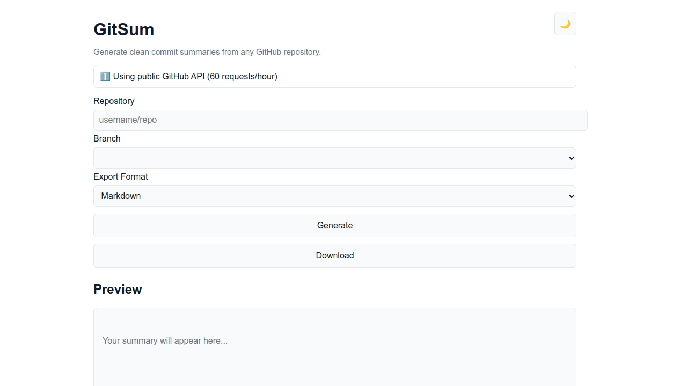

# GitSum


**GitSum** is a lightweight, browser-based tool that transforms raw GitHub commit logs into readable summaries with support for multiple export formats.

## 🚀 Features

- ✨ Generate clean, readable commit summaries
- 📤 Export summaries as:
    - `.json`
    - `.md` (Markdown)
    - `.txt`
- ⚡ Runs entirely in the browser (no installation needed)
- 🧩 Simple and intuitive interface

## 🖥️ Demo

> Turn messy commit logs into clean summaries—and export them anywhere.

➡️ https://mksalada.github.io/gitsum/

## 📸 Preview


---

## 🛠️ How to Use

1. Paste your commit logs into the input field
2. Click Generate Summary
3. Review the output
4. Export in your preferred format:
    - JSON
    - Markdown
    - Text

## 📂 Export Formats

- JSON (`.json`) → Structured data for apps/tools
- Markdown (`.md`) → Perfect for README or documentation
- Text (`.txt`) → Simple and portable

---

## 🧪 Tech Stack

- HTML
- CSS
- JavaScript (Vanilla)

## 📦 Installation

No installation required. Just open the app in your browser.

Or run locally:

```bash
git clone https://github.com/mksalada/gitsum.git
cd gitsum
open index.html
```

---

## 🔮 Roadmap

- [x] 🎨 UI/UX improvements
- [x] 🌙 Dark mode
- [ ] 📋 Copy to clipboard
- [ ] 🔗 GitHub API integration (auto-fetch commits)
- [ ] ⚙️ Custom summary formatting

## 🤝 Contributing

Contributions, issues, and suggestions are welcome!

<!-- ## 📄 License -->

## 💡 Author

Made with ❤️ by [tina](https://github.com/mksalada)
